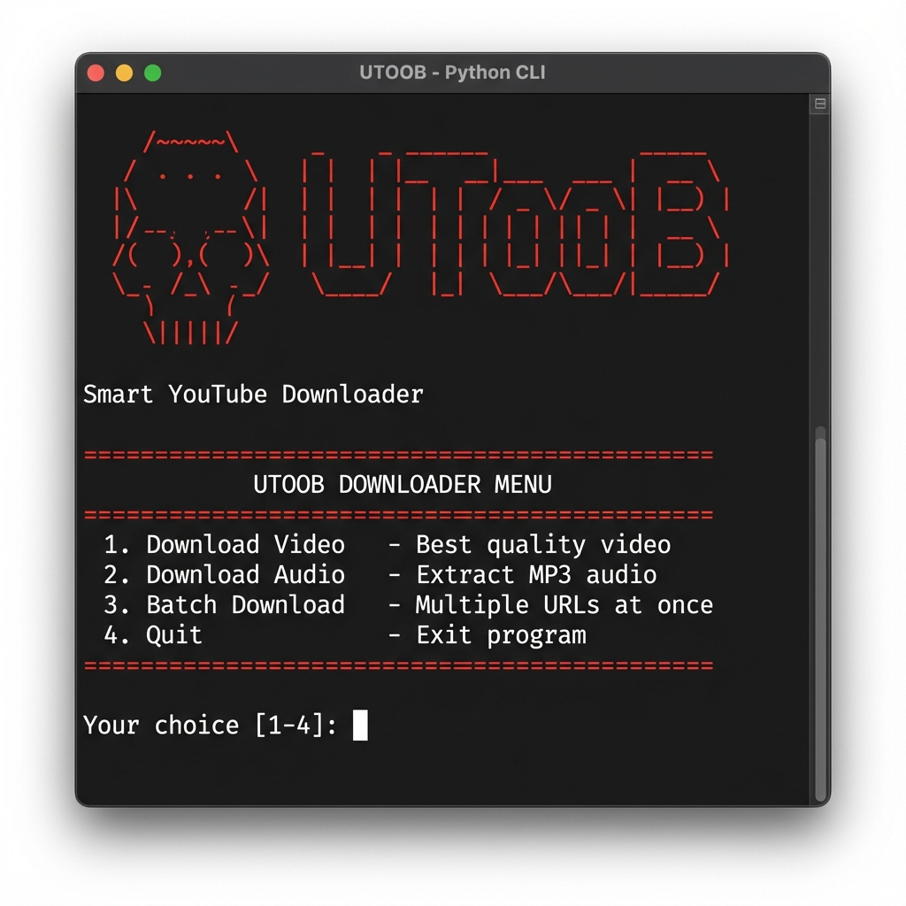
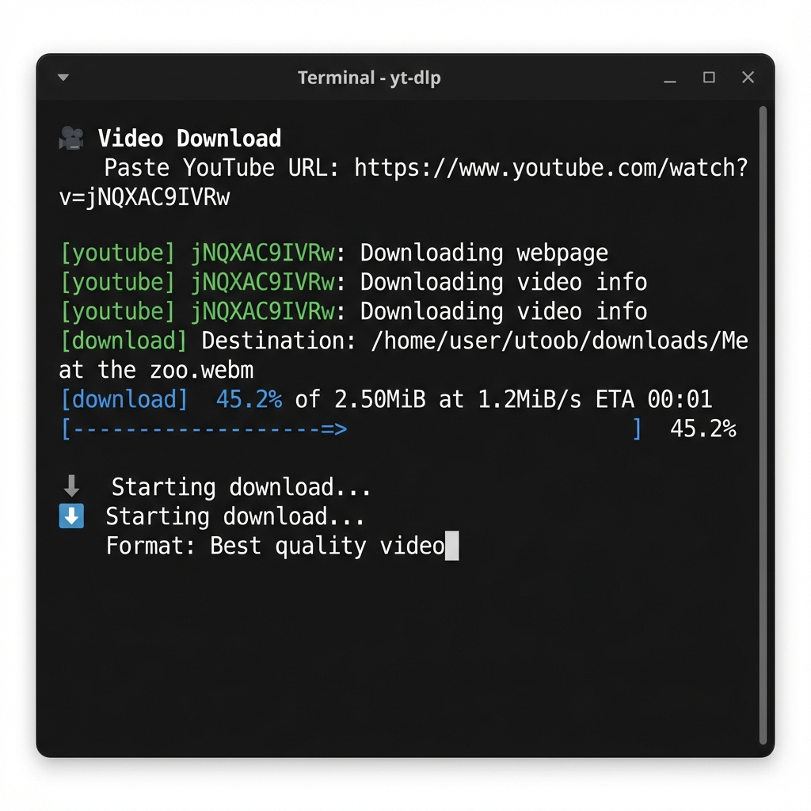
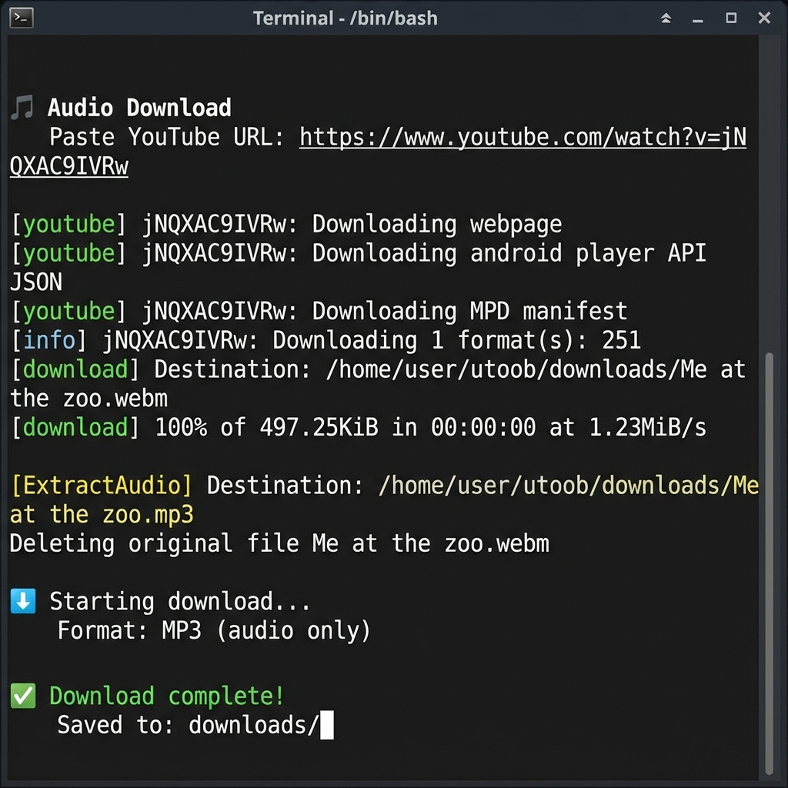
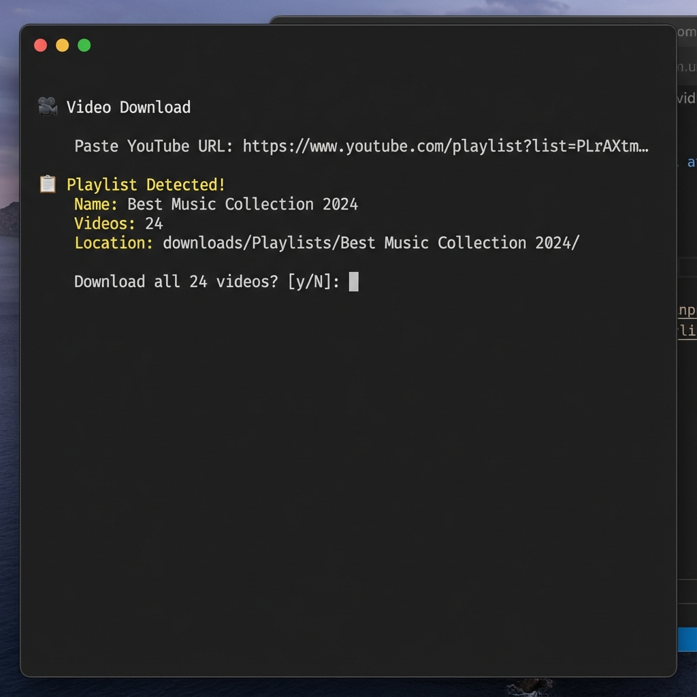

<div align="center"> 


### 🎬 Smart YouTube Downloader
*Lightweight Python CLI tool for downloading YouTube videos, converting to MP3, batch downloads, and playlist management. Self-installing with automatic yt-dlp dependency handling. No configuration needed.*

**Keywords**: youtube downloader, youtube to mp3, video downloader cli, yt-dlp wrapper, python youtube, batch video download, playlist downloader, youtube audio extractor, self-contained youtube tool

[](https://raw.githubusercontent.com/L-Mokolometsa/utoob/main/utoob.py)

</div>

---

## 📂 Folder Structure (after first run)
When you run `python3 utoob.py` for the first time, the script creates a single folder named **`utoob`** in the directory where you invoked it:
```
utoob/
├── utoob.py            # The script itself (moved here on first run)
├── downloads/          # Your downloaded music & videos
│   └── Playlists/      # Organized playlist downloads
└── sys_files/          # Internal files used by the program
    ├── config.json     # User preferences
    ├── cache/           # yt‑dlp binary and temporary files
    └── history.db       # SQLite DB tracking download history
```
All system‑related files are now isolated in `sys_files/`, keeping your `downloads/` folder clean.

> **Note:** After the first run, the script moves itself into the `utoob/` folder, and all downloads are stored in `utoob/downloads/`.

---

## 🚀 Installation

### Quick Start (Recommended)
1. **Download the script**:
```bash
wget https://raw.githubusercontent.com/L-Mokolometsa/utoob/main/utoob.py
# OR
curl -O https://raw.githubusercontent.com/L-Mokolometsa/utoob/main/utoob.py
```

2. **Install required Python packages**:
```bash
pip install requests mutagen
```

3. **Install ffmpeg** (required for audio conversion):
```bash
# Ubuntu/Debian
sudo apt install ffmpeg

# macOS
brew install ffmpeg

# Windows (via chocolatey)
choco install ffmpeg
```

4. **Run it** – the script handles the rest:
```bash
python3 utoob.py
```

### What Gets Installed?
On first run, `utoob.py` will:
1. **Create a `utoob/` folder** in your current directory
2. **Move itself** into `utoob/utoob.py`
3. **Create `sys_files/` subdirectory** with:
   - `cache/` - stores the **yt-dlp binary** (auto-downloaded, ~20MB)
   - `history.db` - SQLite database tracking your downloads
   - `config.json` - user preferences (created as needed)
4. **Create `downloads/` folder** for your media files
5. **Optionally** install a global command (`~/.local/bin/utoob`) if you choose `y` when prompted

**Total disk usage**: ~25MB (script + yt-dlp binary + database)

> ⚠️ **Note**: The script does NOT install any system-level packages or modify system files outside of the `utoob/` folder and optionally `~/.local/bin/`.

### Alternative: Clone the Repository
```bash
git clone https://github.com/L-Mokolometsa/utoob.git
cd utoob
pip install -r requirements.txt
python3 utoob.py
```

---

## 🖥️ Platform Compatibility

| Platform | Core Features | Global Installation |
|----------|---------------|---------------------|
| **Linux** | ✅ Full support | ✅ Works (`~/.local/bin`) |
| **macOS** | ✅ Full support | ✅ Works (`~/.local/bin`) |
| **Termux** | ✅ Full support | ✅ Works (`~/.local/bin`) |
| **Windows** | ✅ Full support | ❌ Manual setup required |

### Windows Users
The script works on Windows, but global installation is not automatic. To use it:
```bash
cd path\to\utoob
python utoob.py
```
Or create a batch file manually in a directory that's in your PATH.

---

## 🎨 Screenshots

### Main Menu & Banner


The startup banner features our nefarious ASCII skull mascot. If `pyfiglet` and `termcolor` are installed, you'll see colorful text rendering.

### Video Download


Downloading a video with progress tracking and automatic quality selection.

### Audio Extraction (MP3)


Converting YouTube videos to MP3 with automatic audio extraction.

### Playlist Detection


Smart playlist detection with confirmation prompts before batch downloads.

---

## 📋 Usage
Run the script:
```bash
python3 utoob.py
```
You will see the interactive menu with 4 options:

**1. Download Video** - Download best quality video
**2. Download Audio** - Extract MP3 audio
**3. Batch Download** - Download multiple URLs at once
**4. Quit** - Exit the program

### Features
- **Playlist Detection**: Automatically detects playlists and asks before downloading all videos
- **Track Numbering**: Playlist items are numbered (e.g., `01 - Song Title.mp3`)
- **Download History**: Tracks downloaded URLs to avoid duplicates
- **Organized Storage**: Playlists saved in `downloads/Playlists/<PlaylistName>/`
- **Metadata Tagging**: Adds ID3 tags to audio files (title, artist, album, track number)
- **MusicBrainz Integration**: Fetches official album artwork when available

---

## 🗑️ Uninstall / Clean‑up
To completely remove utoob and all its data:
```bash
rm -rf /path/to/your/utoob   # removes script, downloads, and sys_files
```
If you only want to delete the program but keep your media, just delete the `utoob/` folder and keep the `downloads/` directory elsewhere.

---

## 📖 Further Reading
- **MusicBrainz API** – used for album‑cover lookup.
- **yt‑dlp** – automatically downloaded on first run and stored in `sys_files/cache/`.

---

## 🏷️ Tech Stack
- **Python 3.7+** - Main language
- **yt-dlp** - YouTube media extraction (auto-downloaded)
- **ffmpeg** - Audio/video processing
- **SQLite** - Download history tracking
- **Mutagen** - ID3 metadata tagging
- **MusicBrainz API** - Album artwork retrieval

---

## 🔍 Related Topics
`youtube-downloader` `youtube-to-mp3` `video-downloader` `yt-dlp` `python-cli` `batch-download` `playlist-downloader` `youtube-audio` `mp3-converter` `self-contained` `portable-tool` `cli-application`

---

Enjoy! 🎵

